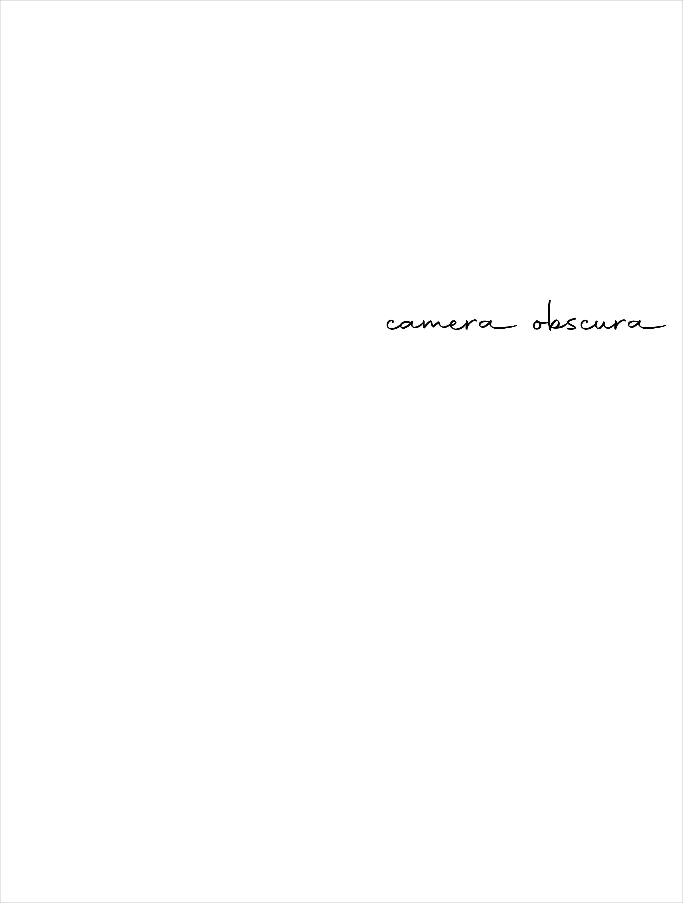
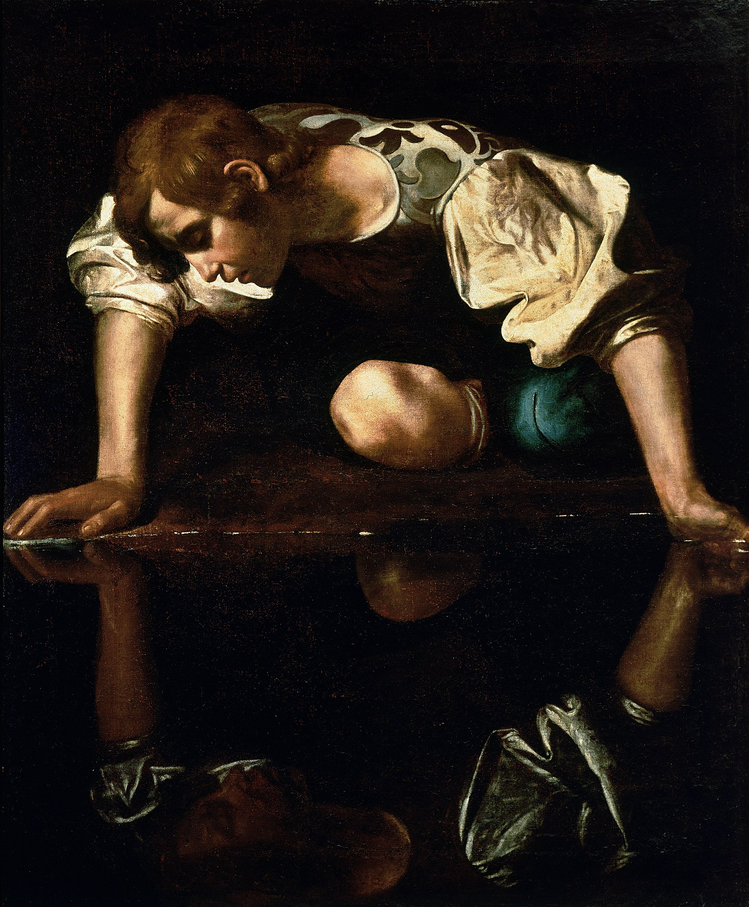

# camera obscura

## ALPHABETUM[^1]

camera obscura \[: *of language*\]

punctus contra punctum  
by  
Kardama Devahuti 

ॐ असतो मा सद्गमय । 
तमसो मा ज्योतिर्गमय । 
मृत्योर्माऽमृतं गमय ॥ 
ॐ शान्तिः शान्तिः शान्तिः ॥ 

## Copyright

Copyright © 2020 Kardama Devahuti 

All rights reserved.

No part of this publication may be reproduced, stored in a retrieval
system, stored in a database and / or published in any form or by any
means, electronic, mechanical, photocopying, recording or otherwise,
without the prior written permission of the publisher.

Published in કલા નગરી, *kalā nagarī*: “city of art” by મન, *man*:
“mind”[^2]

Cataloging in Publication Data

Name: Kardama Devahuti, 2023— author 
Title: camera obscura/ Kardama Devahuti  
ASIN: 
Subjects: 1. Signs & Symbols 2. Photography 

## Dedication  

To JANUS: “a going, a going through, passage; of janua” [^3]

## Contents

Translator's Acknowledgements

1. What is LANGUAGE?
2. What is NOT?
3. Notes
4. LATINUM
5. Index

## Translator's Acknowledgements

> What has an ox to do with the letter A?[^4]

## IMAGO: “image”[^5]

 
Narcissus by Caravaggio (1599)[^6]

## INCIPIO: “I begin”[^7]

> The camera obscura is that language \[langage\], as new as the
>    project itself, which would make it possible to disguise nothing, to
>    disclose all, down to the last detail, even at the risk of appearing
>    impertinent, at the risk of being ridiculous and indecent. Only in
>    this way might one find one’s way amidst the chaos of contradictory
>    feelings, amidst ‘this bizarre and singular assemblage’ which
>    nevertheless constitutes a self. [^8]

## What is LANGUAGE?

> Lan"guage (?), *n.* \[OE. *langage*, F. *langage*, fr. L. *lingua* the
> tongue, hence speech, language; akin to E. *tongue*.
> See <u>Tongue</u>, cf. <u>Lingual</u>.\]
>
>    1. Any means of conveying or communicating ideas; specifically, human
>        speech; the expression of ideas by the voice; sounds, expressive of
>        thought, articulated by the organs of the throat and mouth. 
>    2.  The expression of ideas by writing, or any other instrumentality. 
>    3.  The forms of speech, or the methods of expressing ideas, peculiar to a particular nation. 
>    4.  The characteristic mode of arranging words, peculiar to an individual speaker or writer; manner of expression; style. 
>    5.  The inarticulate sounds by which animals inferior to man express their feelings or their wants. 
>    6.  The suggestion, by objects, actions, or conditions, of ideas associated therewith; as, the language of flowers. 
>    7.  The vocabulary and phraseology belonging to an art or department of knowledge; as, medical language; the language of chemistry or theology. 
>    8.  A race, as distinguished by its speech. \[R.\] 
>
> Language master, a teacher of languages. \[Obs.\]
>
> Syn. -- Speech; tongue; idiom; dialect; phraseology; diction;
> discourse; conversation; talk.
> -- <u>Language</u>, <u>Speech</u>, <u>Tongue</u>, <u>Idiom</u>, <u>Dialect</u>. *Language* is
> generic, denoting, in its most extended use, any mode of conveying
> ideas; *speech* is the language of articulate sounds; *tongue* is the
> Anglo-Saxon term for language, esp. for spoken language; as, the
> English *tongue*.  *Idiom* denotes the forms of construction peculiar
> to a particular language; *dialects* are varieties of expression which
> spring up in different parts of a country among people speaking
> substantially the same *language*. [^9]

## What is NOT?

> Not, *adv.* \[OE. *not*, *noht*, *nought*, *naught*, the same word as
> E. *naught*. See<u>Naught</u>.\] A word used to express negation,
> prohibition, denial, or refusal.[^10]

## LATINUM  

Excerpt From *DE LINGUA LATINA*, Book V: On the Science of the Origin of Words, Addressed to Cicero[^11]
 

    By MARCUS TERENTIUS VARRO [Translation By Roland G. Kent]

1.  In what way names were applied to things in Latin, I have undertaken
    to expound, in six books. Of these, I have already composed three
    before this one, and have addressed them to Septumius; in them I
    treat of the branch of learning which is called Etymology-. The
    considerations which might be raised against it, I have put in the
    first book; those adduced in its favour, in the second; those merely
    describing it, in the third. In the following books, addressed to
    you, I shall discuss the problem from what things names were applied
    in Latin, both those which are habitual with the ordinary folk,
    and those which are found in the poets.

2.  Inasmuch as each and every word has two innate features, from what
    thing and to what thing the name is applied (therefore, when the
    question is raised from what thing pertinacia 'obstinacy' is, it is
    shown to be from pertendere' to persist' : to what thing it is
    applied, is told when it is explained that it is pertinacia
    'obstinacy' in a matter in which there ought not to be persistence
    but there is, because it is perseverantia' steadfastness' if a
    person persists in that in which he ought to hold firm), that former
    part, where they examine why and whence words are, the Greeks call
    Etymology, that other part they call Semantics. Of these two matters
    I shall speak in the following books, not keeping them apart, but
    giving less attention to the second.

3.  These relations are often rather obscure for the following reasons:
    Not every word that has been applied, still exists, because lapse of
    time has blotted out some. Not every word that is in use, has been
    applied without inaccuracy of some kind, nor does every word which
    has been applied correctly remain as it originally was; for many
    words are disguised by change of the letters. There are some whose
    origin is not from native words of our own language. Many words
    indicate one thing now, but formerly meant something else, as is the
    case with hostis 'enemy' : for in olden times by this word they
    meant a foreigner from a country independent of Roman laws, but now
    they give the name to him whom they then called perduellis 'enemy.'

4.  I shall take as starting-point of my discussion that derivative or
    case-form of the words in which the origin can be more clearly seen.
    It is evident that we ought to operate in this way, because when we
    say inpos 'lacking power' in the nominative, it is less clear that
    it is from potentia 'power' than when wesay inpotem in the
    accusative ; and it becomes the more obscure, if you say pos ‘having
    power' rather than inpos; for pos seems to mean rather pons 'bridge'
    than potens ' powerful.'

5.  There are few things which lapse of time does not distort, there are
    many which it removes. Whom you saw beautiful as a boy, him you see
    unsightly in his old age. The third generation does not see a person
    such as the first generation saw him. Therefore those that oblivion
    has taken away even from our ancestors, the painstaking of Mucius
    and Brutus, though it has pursued the runaways, cannot bring back.
    As for me, even if I cannot track them down, I shall not be the
    slower for this, but even for this I shall be the swifter in the
    chase, if I can. For there is no slight darkness in the wood where
    these things are to be caught, and there are no trodden paths to the
    place which we wish to attain, nor do there fail to be obstacles in
    the paths, which could hold back the hunter on his way.

6.  Now he who has observed in how many ways the changing has taken
    place in those words, new and old, in which there is any and every
    manner of variation in popular usage, will find the examination of
    the origin of the words an easier task; for he will find that words
    have been changed, as I have shown in the preceding books,
    essentially on account of two sets of four causes. For the
    alterations come about by the loss or the addition of single letters
    and on account of the transposition or the change of them, and
    likewise by the lengthening or the shortening of syllables, and
    their addition or loss: since I have adequately shown by examples,
    in the preceding books, of what sort these phenomena are, I have
    thought that here 1 need only set a reminder of that previous
    discussion.
    

## Notes

Belsare, Malhar Bhikaji. *ગુજરાતી-અંગ્રેજી ડિકશનરી \[Etymological
Gujarati-English Dictionary\].* 2nd Edition, Asian Educational Services,
2002.

Caravaggio. "Narcissus." oil and chiaroscuro on canvas, Galleria 
Nazionale d'Arte Antica, 1599.

Fletcher, Alan. *The Art of Looking Sideways.* Phaidon Press, 2001.

Kofman, Sarah. *Camera Obscura: Of Ideology.* Cornell University Press,
1999.

Lewis, Charles T and Charles Short. *Harper's Latin Dictionary: A New
Latin Dictionary Founded on the Translation of Freund's Latin-German
Lexicon, Ed.* Edited by E.A. Andrews, American Book Company, 1907.

Varro. *On the Latin Language with an English Translation by Roland G.
Kent.* Translated by Roland G. Kent, Harvard University Press, 1938.

Webster, Noah. *Webster's New International Dictionary of the English
Language: Based on the International Dictionary of 1890 and 1900*,
Edited by William Torrey Harris, G. & C. Merriam Company, 1913.

## Index

Σ\*={*Webster's New International Dictionary of the English Language*}[^12]

[^1]: alphabetum, i,n.,= άλφα-βήτα, *the alphabet*, Tert. Haert. 50;
    Hier. Ep 125.

    Lewis, Charles T and Charles Short. *Harper's Latin Dictionary: A
    New Latin Dictionary Founded on the Translation of Freund's
    Latin-German Lexicon, Ed.* Edited by E.A. Andrews, American Book
    Company, 1907.

[^2]: તન-મન-ધન a. n. \[See તન + મન + ધન\] Lit. The body, the mind, and
    one’s wealth. Hence, 2. All that one loves; the highest object of
    one’s ambition (Belsare, 577).

    Belsare, Malhar Bhikaji. *ગુજરાતી-અંગ્રેજી ડિકશનરી \[Etymological
    Gujarati-English Dictionary\].* 2nd Edition, Asian Educational
    Services, 2002.

[^3]: Lewis, Charles T and Charles Short. *Harper's Latin Dictionary: A
    New Latin Dictionary Founded on the Translation of Freund's
    Latin-German Lexicon, Ed.* Edited by E.A. Andrews, American Book
    Company, 1907.

[^4]: Fletcher, Alan. *The Art of Looking Sideways.* Phaidon Press,
    2001.

[^5]: îmāgo inis, *f.* \[cf. imitor\], *an imitation, copy of a thing,
    an image, likeness* (i.e. a picture, statue, mask, an apparition,
    ghost, phantom; the latter only poet. and in post-Aug. prose; cf.:
    simulacrum. effgies, statua, sigillum):

    Lewis, Charles T and Charles Short. *Harper's Latin Dictionary: A
    New Latin Dictionary Founded on the Translation of Freund's
    Latin-German Lexicon, Ed.* Edited by E.A. Andrews, American Book
    Company, 1907.

[^6]: Caravaggio. "Narcissus." oil and chiaroscuro on canvas, 
    Galleria Nazionale d'Arte Antica, 1599.

[^7]: incîpîo cepi, ceptum, 3 (archaic incepsit inceperit, Paul. ex
    Fest. p. 107 Müll.), *v. a.* and *n.* \[in-capio; lit., to seize upon,
    lay hold of ; opp. to desinere; hence, with the accessory idea of
    action), *to begin* to do something, *to take in hand* (syn. incoho; in
    class. prose, viz. in Cic., only in the *tempp. press.*, while coepi
    is used in the *tempp. perff.*); constr. usually with the *inf*, less
    freq. *absol.*, with the *acc., ab,* or *adv. of place or time*.

    Lewis, Charles T and Charles Short. *Harper's Latin Dictionary: A
    New Latin Dictionary Founded on the Translation of Freund's
    Latin-German Lexicon, Ed.* Edited by E.A. Andrews, American Book
    Company, 1907.

[^8]: Kofman, Sarah. *Camera Obscura: Of Ideology.* Cornell University
    Press, 1999.

[^9]: Webster, Noah. *Webster's New International Dictionary of the
    English Language: Based on the International Dictionary of 1890 and
    1900*, Edited by William Torrey Harris, G. & C. Merriam Company,
    1913.

[^10]: ibid.

[^11]: Varro. *On the Latin Language with an English Translation by
    Roland G. Kent.* Translated by Roland G. Kent, Harvard University
    Press, 1938.

[^12]: The set of all words in *Webster's New International Dictionary
    of the English Language*

    Webster, Noah. *Webster's New International Dictionary of the
    English Language: Based on the International Dictionary of 1890 and
    1900*, Edited by William Torrey Harris, G. & C. Merriam Company,
    1913.
